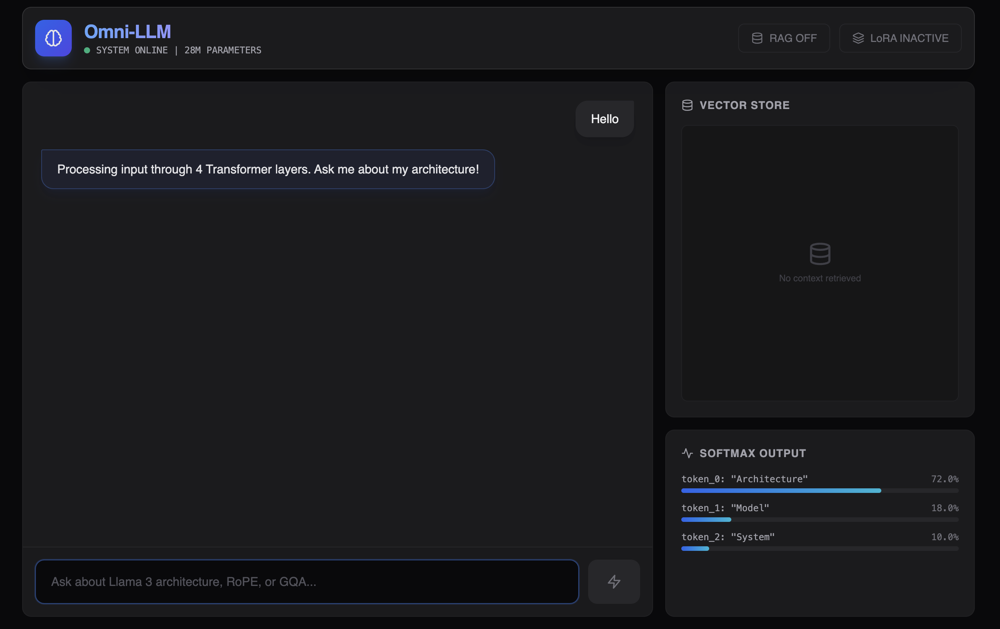
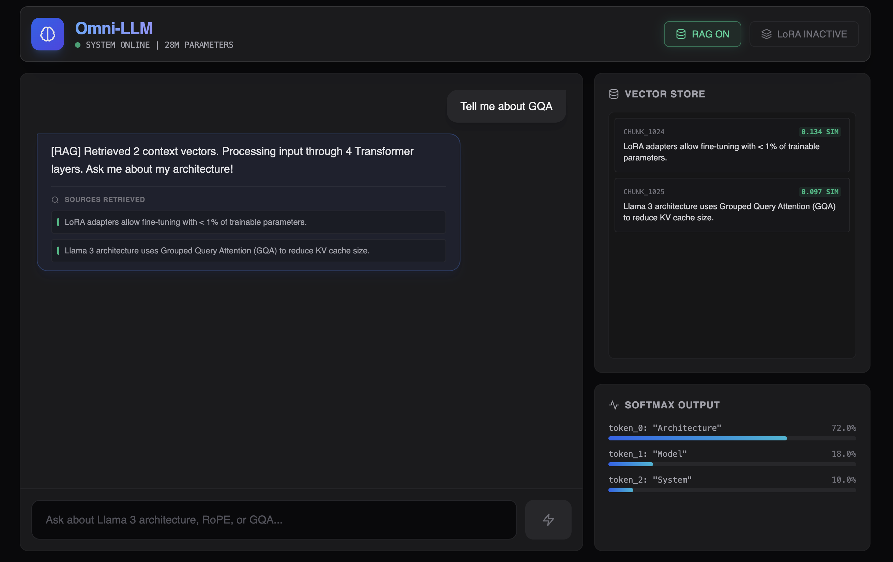
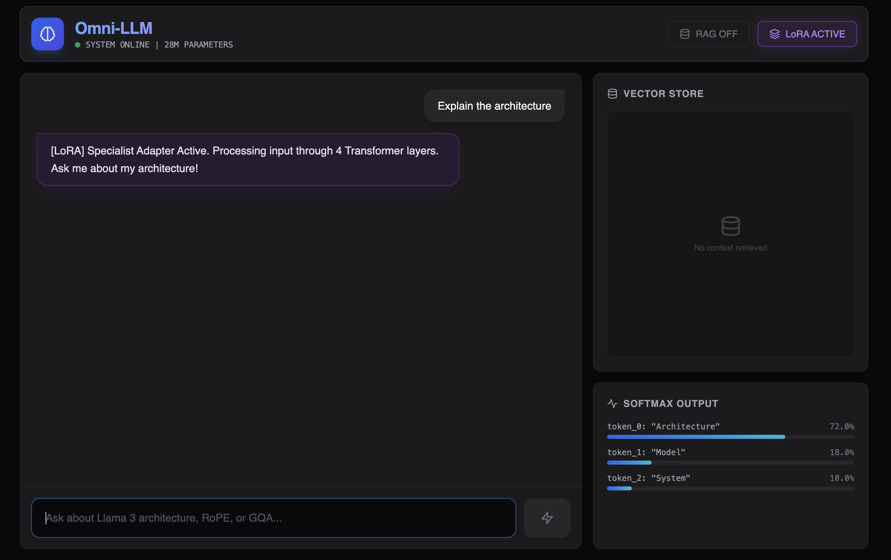
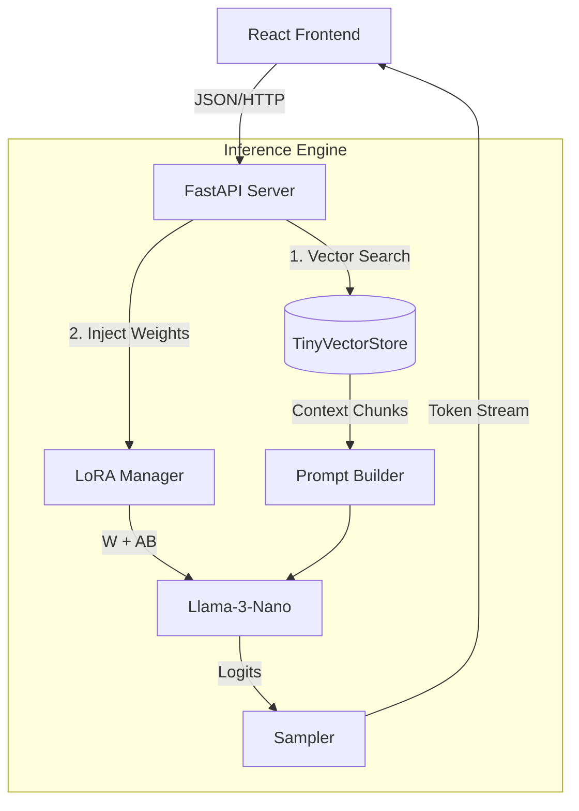

# Omni-LLM: A Ground-Up Implementation of Llama 3 🦙

<div align="center">


**[View Live Demo](https://omni-llm.vercel.app)** | **[Read the Architecture Docs](src/model.py)**

</div>

---

## 🧠 Project Overview

Omni-LLM provides a transparent, from-scratch implementation of the Meta Llama 3 architecture in PyTorch, showcasing the full inner workings of modern Transformer models without relying on external APIs.

It also includes:

- A custom-built **RAG (Retrieval Augmented Generation)** engine using cosine similarity (linear algebra), not a hosted vector DB.
- A dynamic **LoRA (Low-Rank Adaptation)** injection system for runtime adapter swapping.

---

## Interface & Visualization

### 1) The Workbench

The dashboard visualizes inference behavior, including token probability distributions and vector retrieval scores.



### 2) RAG & LoRA Internals

| Retrieval Augmented Generation (RAG) | Low-Rank Adaptation (LoRA) |
|:---:|:---:|
|  |  |
| *Vector search similarity scores* | *Dynamic adapter injection changing tone* |

---

## Key Technical Features

### Architecture (Llama 3)

Implemented the architectural patterns used in modern LLMs:

- **RMSNorm (Root Mean Square Normalization)**: implemented manually to replace LayerNorm for stability.
- **RoPE (Rotary Positional Embeddings)**: complex-number rotation for relative positional encoding.
- **SwiGLU Activation**: Swish-Gated Linear Unit for improved convergence.
- **Grouped Query Attention (GQA)**: reduces KV-cache memory usage during inference.

### Systems Engineering

- **Vector DB from scratch**: `numpy.dot()`-based cosine similarity without Pinecone/Chroma/etc.
- **KV-caching**: caches Key/Value states for efficient autoregressive decoding.
- **LoRA injection**: runtime wrapper that injects low-rank matrices (**A × B**) into Linear layers.

---

## 📐 System Design

The system cleanly decouples the neural network (“brain”) from the API server.



---

## Local Setup

### Prerequisites

- Python 3.10+
- Node.js

### 1) Backend Setup

```bash
# Clone and enter repo
git clone https://github.com/yourusername/omni-llm.git
cd omni-llm

# Create virtual environment
python -m venv venv
source venv/bin/activate 

# Install dependencies
pip install -r requirements.txt

# Run the server
uvicorn src.app:app --reload --port 8001
```

### 2) Frontend Setup

Open `frontend/index.html` in your browser. It’s built to run **without** a build step for portability.

---

## 🧪 Technical Deep Dive

### The Math of Retrieval

Instead of using a library, vector similarity is implemented directly for low-latency CPU retrieval:

\[
\text{Similarity}(A, B) = \frac{A \cdot B}{\|A\| \, \|B\|}
\]

Implementation reference: `src/app.py` (cosine similarity routine).

### LoRA Implementation

LoRA adapts the base weight matrix \(W\) by adding a low-rank update:

\[
h = W_0 x + \Delta W x = W_0 x + B A x
\]

where \(B \in \mathbb{R}^{d \times r}\) and \(A \in \mathbb{R}^{r \times d}\), with rank \(r \ll d\).

---

## 📂 Project Structure

```bash
omni-llm/
├── assets/                  # Documentation screenshots
│   ├── dashboard_main.png
│   ├── rag_demo.png
│   └── lora_demo.png
├── frontend/                # React dashboard
│   └── index.html           # Single-file UI (zero-build)
├── src/                     # Core logic
│   ├── app.py               # RAG engine & API server
│   └── model.py             # Llama 3 architecture (PyTorch)
├── Dockerfile               # Containerization config
├── Makefile                 # Dev automation
└── requirements.txt         # Dependency pinning
```
---

## 📄 License

MIT License — feel free to use this architecture for learning or your own portfolio.

---

## 📚 References & Research

1. **Llama 3 Architecture** — AI at Meta (2024). *The Llama 3 Flock of Models*.  
2. **RoPE** — Su, J., et al. (2021). *RoFormer: Enhanced Transformer with Rotary Position Embedding*.  
3. **LoRA** — Hu, E. J., et al. (2021). *LoRA: Low-Rank Adaptation of Large Language Models*.  
4. **SwiGLU** — Shazeer, N. (2020). *GLU Variants Improve Transformer*.  
5. **GQA** — Ainslie, J., et al. (2023). *GQA: Training Generalized Multi-Query Transformer Models from Multi-Head Checkpoints*.

---

## 🔧 Troubleshooting

### Issue: `Address already in use`

If `uvicorn` fails to start, a previous process might be holding the port:

```bash
# Kill process on port 8001 (macOS/Linux)
lsof -ti:8001 | xargs kill -9

# Or run on a different port
uvicorn src.app:app --reload --port 8002
```

### Issue: `ModuleNotFoundError: No module named 'tiktoken'`

Make sure you're in the virtual environment, then install requirements:

```bash
source venv/bin/activate
pip install -r requirements.txt
```

<div align="center">
  <sub>Designed &amp; engineered by <b>Aseem Garg</b></sub>
</div>
